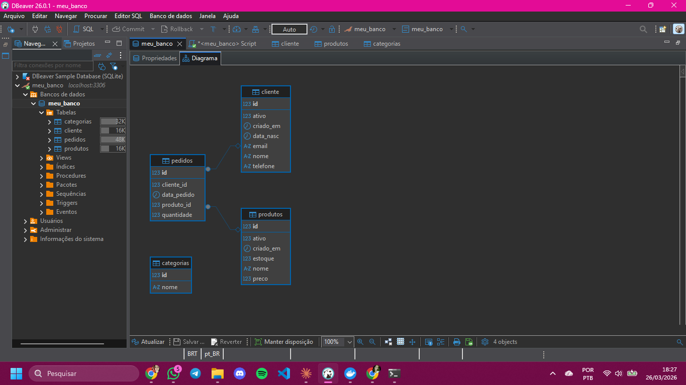

# 🛒 Banco de Dados E-commerce

Projeto de modelagem de banco de dados desenvolvido utilizando MariaDB, com foco em um sistema simples de e-commerce.

---

## 📊 Diagrama do Banco

O modelo abaixo representa a estrutura das tabelas e seus relacionamentos:



---

## 🧱 Estrutura do Banco

O banco é composto pelas seguintes tabelas:

### 👤 Cliente

Armazena os dados dos clientes.

* `id` (PK)
* `nome`
* `email`
* `telefone`
* `data_nasc`
* `ativo`
* `criado_em`

---

### 📦 Produtos

Armazena os produtos disponíveis para venda.

* `id` (PK)
* `nome`
* `preco`
* `estoque`
* `ativo`
* `criado_em`

---

### 🧾 Pedidos

Registra os pedidos realizados pelos clientes.

* `id` (PK)
* `cliente_id` (FK)
* `produto_id` (FK)
* `quantidade`
* `data_pedido`

---

### 🏷️ Categorias

Classificação dos produtos.

* `id` (PK)
* `nome`

---

## 🔗 Relacionamentos

* Um **cliente** pode fazer vários **pedidos**
* Um **pedido** está ligado a um **cliente**
* Um **pedido** contém um **produto**
* Um **produto** pode pertencer a uma **categoria** (estrutura preparada para evolução)

---

## ⚙️ Tecnologias utilizadas

* MariaDB
* SQL
* DBeaver
* Docker

---

## 🚀 Como executar o projeto

1. Criar o banco de dados:

```sql
CREATE DATABASE meu_banco;
```

2. Selecionar o banco:

```sql
USE meu_banco;
```

3. Executar o script SQL:

```bash
database.sql
```

---

## 📌 Melhorias futuras

* Implementar tabela de itens do pedido (modelo mais escalável)
* Relacionar produtos com categorias (FK)
* Inserção de dados fictícios
* Criação de consultas com JOIN
* Geração de relatórios

---

## 💡 Objetivo do projeto

Este projeto foi desenvolvido para fins de estudo, com o objetivo de praticar:

* Modelagem de banco de dados
* Criação de tabelas e relacionamentos
* Uso de SQL na prática
* Versionamento com Git e GitHub

---

## 👩‍💻 Autora

Fabiana Bourdokan Valiente

---
